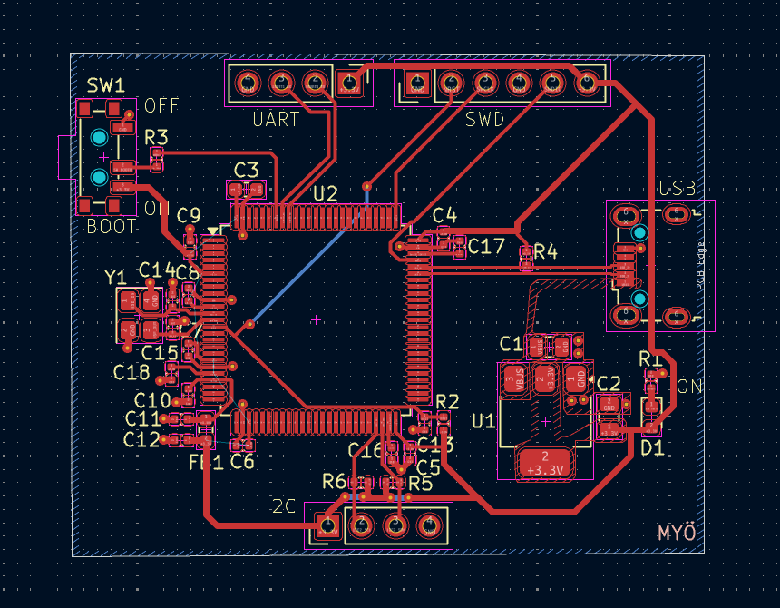
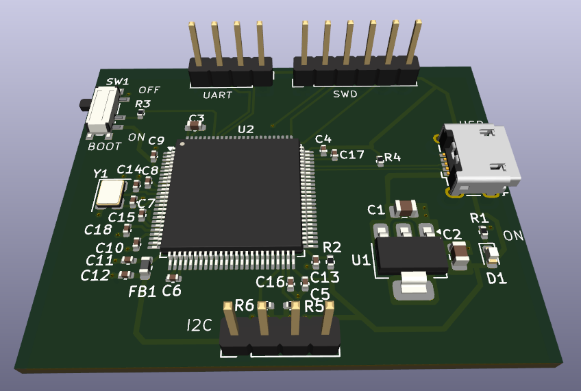

# STM32F4 Development Board – First PCB Design

This repository contains my first STM32-based PCB design.

The board is designed as a simple development board around an STM32F4 series microcontroller.
It includes:
- Power supply and regulation
- USB interface
- SWD programming and debugging interface
- Basic clock and decoupling circuitry

## Project Scope

This project was mainly focused on learning the **hardware design workflow**:
- Drawing the schematic
- Power and bypass (decoupling) capacitor placement
- USB D+/D− differential pair routing
- Pull-up resistor usage
- Debug interface connections
- PCB placement and routing

Rather than aiming for a production-ready board, the goal was to understand *why* certain hardware design rules exist and how they affect a real PCB.

## Visual Overview

Below are some visuals from the design process to give a quick overview without opening the design files.

### PCB Layout

### 3D View

## Folder Structure

- pcb/ → KiCad PCB layout files
- schematic/ → KiCad schematic files
- images/ → Schematic, PCB and 3D render images

## Notes

- This is my **first PCB design**, so the focus was learning and experimentation.
- Many design decisions were made by researching, testing, and iterating.
- The project helped me clearly see the difference between theory and real-world PCB layout constraints.

## Tools Used

- KiCad
- STM32 reference documentation

## Status

Design completed.  
The project is kept as a learning reference and portfolio example.
